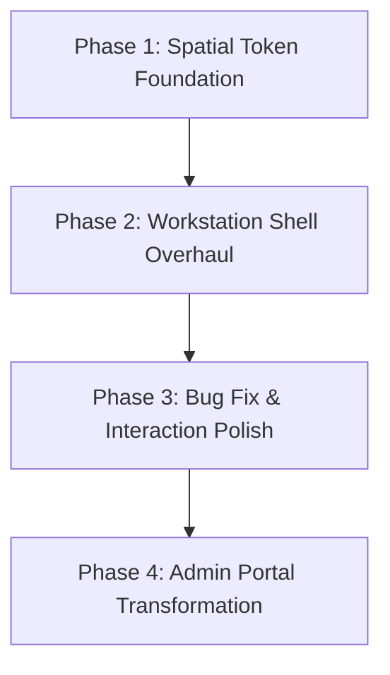

# Implementation Plan: Saybrook Major Final Polish Pass (2026 Tier)

**Status**: Draft
**Topic Slug**: saybrook-final-polish-plan
**Task Complexity**: medium

---

## 1. Plan Overview

This plan overhauls the Saybrook Zoning Clerk UI into a "2026 Spatial Workstation." We will refine the styling foundation, fix a disruptive interaction bug, and transform the Trustee Portal into a professional administrative terminal.

- **Total Phases**: 4
- **Agents Involved**: `design_system_engineer`, `coder`, `ux_designer`, `copywriter`, `tester`
- **Estimated Effort**: ~8-10 turns

---

## 2. Dependency Graph

---

## 3. Execution Strategy

| Phase | Objective | Agent | Execution Mode |
|-------|-----------|-------|----------------|
| 1 | Establish ultra-modern blur, shadow, and border tokens. | `design_system_engineer` | Sequential |
| 2 | Apply spatial depth and glassmorphism to Sidebar and Chat. | `coder`, `ux_designer` | Sequential |
| 3 | Remove drawer auto-open bug and polish message pods. | `coder` | Sequential |
| 4 | Scrub demo language and restyle Trustee Portal. | `copywriter`, `coder` | Sequential |

---

## 4. Phase Details

### Phase 1: Spatial Token Foundation
**Objective**: Establish high-fidelity design tokens for 2026-tier visuals.

- **Agent Assignment**: `design_system_engineer`.
- **Files to Modify**:
  - `websites/saybrook-zoning/src/index.css`: Update `@theme` block with deeper `blur` tiers and sophisticated `shadow` tokens.
- **Implementation Details**:
  - Add specific tokens for `glass-thin` (0.5px border), `glass-heavy` (higher saturation), and `kinetic-shadow`.
- **Validation Criteria**:
  - `npm run dev` shows no breakages; tokens are available in dev tools.

### Phase 2: Workstation Shell Overhaul
**Objective**: Transform shells into physical, floating layers.

- **Agent Assignment**: `coder`, `ux_designer`.
- **Files to Modify**:
  - `websites/saybrook-zoning/src/App.css`: Overhaul `.saybrook-chat-shell`, `.saybrook-sidebar-card`, and `.saybrook-app` gradients.
- **Implementation Details**:
  - Apply stacked `backdrop-filter` (blur + saturate) and `mask-image` edge fades for a spatial feel.
- **Validation Criteria**:
  - Layout has clear physical depth and feels like floating glass.

### Phase 3: Bug Fix & Interaction Polish
**Objective**: Fix the drawer auto-open bug and refine chat interactions.

- **Agent Assignment**: `coder`.
- **Files to Modify**:
  - `websites/saybrook-zoning/src/pages/ChatAssistant.jsx`: Remove `setDrawerOpen(true)` from `handleSend` success path.
  - `websites/saybrook-zoning/src/pages/ChatAssistant.jsx`: Re-style message bubbles as "spatial pods."
- **Implementation Details**:
  - Refactor message pod CSS to use the new glass tokens.
- **Validation Criteria**:
  - Receiving a message NO LONGER opens the drawer automatically.
  - Chat bubbles have micro-shadows and better internal depth.

### Phase 4: Admin Portal Transformation
**Objective**: Final Copy audit and style pass for the Trustee Portal.

- **Agent Assignment**: `copywriter`, `coder`.
- **Files to Modify**:
  - `websites/saybrook-zoning/src/pages/TrusteeQueue.jsx`: Total copy overhaul and restyle.
- **Implementation Details**:
  - Scrub: "Internal / trustee only", "UI-facing capability cues only", "Feature runway", etc.
  - Replace with: "Municipal Records Division", "Advanced Triage Core", "System Capabilities", etc.
  - Apply Phase 1/2 styling to all cards and headers.
- **Validation Criteria**:
  - Trustee view feels like a premium, production-ready workstation.
  - Final `npm run build` and `npm run lint` are clean.

---

## 5. File Inventory

| File | Phase | Action | Purpose |
|------|-------|--------|---------|
| `src/index.css` | 1 | Modify | High-fidelity token foundation. |
| `src/App.css` | 2 | Modify | Spatial shell overhauls. |
| `src/pages/ChatAssistant.jsx` | 3 | Modify | Bug fix and bubble pods. |
| `src/pages/TrusteeQueue.jsx` | 4 | Modify | Authoritative copy and style overhaul. |

---

## 6. Execution Profile

- **Total phases**: 4
- **Parallelizable phases**: 0 (Sequential preferred for design system continuity)
- **Estimated serial wall time**: 8-10 turns

---

## 7. Cost Estimation

| Phase | Agent | Model | Est. Input | Est. Output | Est. Cost |
|-------|-------|-------|-----------|------------|----------|
| 1 | `design_system_engineer` | Flash | 2,000 | 500 | $0.01 |
| 2 | `coder` | Pro | 4,000 | 1,500 | $0.10 |
| 3 | `coder` | Flash | 3,000 | 500 | $0.01 |
| 4 | `coder` | Pro | 4,000 | 2,000 | $0.12 |
| **Total** | | | **13,000** | **4,500** | **$0.24** |

*Note: Costs are estimates with a 50% retry buffer.*
