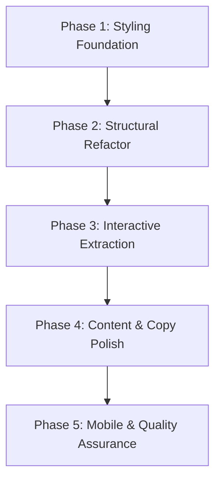

# Implementation Plan: Saybrook Zoning Clerk UI Redesign

**Status**: Draft
**Topic Slug**: saybrook-ui-redesign-plan
**Task Complexity**: medium

---

## 1. Plan Overview

This plan overhauls the Saybrook Zoning Clerk UI into a "Civic Workstation" layout. We will transition from a vertical brochure-style stack to a focused interactive canvas with a persistent sidebar and a contextual intake drawer.

- **Total Phases**: 5
- **Agents Involved**: `design_system_engineer`, `architect`, `coder`, `ux_designer`, `copywriter`, `tester`
- **Estimated Effort**: ~12-15 turns

---

## 2. Dependency Graph

---

## 3. Execution Strategy

| Phase | Objective | Agent | Execution Mode |
|-------|-----------|-------|----------------|
| 1 | Map brand tokens to Tailwind & unify CSS. | `design_system_engineer` | Sequential |
| 2 | Refactor App.jsx into split-screen workstation. | `architect`, `coder` | Sequential |
| 3 | Decouple intake form into Slide-Over Drawer. | `coder`, `ux_designer` | Sequential |
| 4 | Remove prototype framing & polish copy. | `copywriter`, `coder` | Sequential |
| 5 | Implement mobile shell & verify build. | `ux_designer`, `tester` | Sequential |

---

## 4. Phase Details

### Phase 1: Styling Foundation
**Objective**: Unified brand tokens across CSS and Tailwind utility classes.

- **Agent Assignment**: `design_system_engineer` — Specialist in design token mapping and CSS architecture.
- **Files to Modify**:
  - `websites/saybrook-zoning/src/index.css`: Map `--saybrook-*` variables into the Tailwind `@theme` block.
  - `websites/saybrook-zoning/src/App.css`: Consolidate palette and remove conflicting `ashtabula` token usage.
- **Implementation Details**:
  - Map variables: `forest`, `fern`, `lake`, `mist`, `cream`, `sand`, `clay`, `ink`.
  - Ensure contrast ratios are pitch-ready (e.g., deep Forest text on Sand background).
- **Validation Criteria**:
  - `npm run dev` shows consistent branding using Tailwind classes like `bg-saybrook-forest`.

### Phase 2: Structural Refactor
**Objective**: Transform App.jsx into a flex-split "Digital Desk."

- **Agent Assignment**: `architect` (Design), `coder` (Implementation).
- **Files to Create**:
  - `websites/saybrook-zoning/src/components/CivicSidebar.jsx`: New component for branding, seal, and status.
- **Files to Modify**:
  - `websites/saybrook-zoning/src/App.jsx`: Refactor `main` into a flex container with `<CivicSidebar />` and `<ChatAssistant />`.
- **Implementation Details**:
  - Sidebar: Fixed width (320px-360px) on desktop, sticky position.
  - Main Canvas: Flexible width, overflow-hidden to support internal chat scrolling.
- **Validation Criteria**:
  - Layout matches "Civic Workstation" design document.
  - Township seal and RAG status are visible in the sidebar.

### Phase 3: Interactive Extraction
**Objective**: Decouple the intake form into a Slide-Over Drawer.

- **Agent Assignment**: `coder`, `ux_designer`.
- **Files to Create**:
  - `websites/saybrook-zoning/src/components/IntakeDrawer.jsx`: Extract form logic from `ChatAssistant.jsx`.
- **Files to Modify**:
  - `websites/saybrook-zoning/src/pages/ChatAssistant.jsx`: Remove inline intake form and `requestOpen` logic; implement Drawer trigger.
- **Implementation Details**:
  - Pass `messages` and form state down to `IntakeDrawer`.
  - Use a high-contrast Forest/Sand slide-over transition from the right.
- **Validation Criteria**:
  - "Finalize Request" CTA opens drawer without losing chat context.
  - Image upload and queue submission logic remains functional.

### Phase 4: Content & Copy Polish
**Objective**: Eliminate "prototype" feel through professional copy and tool-visibility.

- **Agent Assignment**: `copywriter`, `coder`.
- **Files to Modify**:
  - `websites/saybrook-zoning/src/pages/ChatAssistant.jsx`
  - `websites/saybrook-zoning/src/components/CivicSidebar.jsx`
  - `websites/saybrook-zoning/src/components/QuickQuestions.jsx`
- **Implementation Details**:
  - Remove all occurrences of "draft," "demo," "guidance only," and "unofficial."
  - Re-style "Quick Prompts" as professional workstation entry points.
  - Enhance Citation cards with sharper borders and high-contrast labels.
- **Validation Criteria**:
  - All visible text projects municipal authority.
  - Visual hierarchy clearly separates "System Messages" from "Resident Questions."

### Phase 5: Mobile & Quality Assurance
**Objective**: Finalize mobile adaptations and verify production build.

- **Agent Assignment**: `ux_designer`, `tester`.
- **Files to Modify**:
  - `websites/saybrook-zoning/src/App.jsx`
  - `websites/saybrook-zoning/src/App.css`
- **Implementation Details**:
  - Implement `@media` logic to collapse sidebar into a top "Status Bar" on mobile.
  - Ensure chat composer is always reachable on touch devices.
- **Validation Criteria**:
  - `npm run build` succeeds without errors.
  - `npm run lint` passes.
  - Smoke test: Ask question -> View Citations -> Submit to Queue (mocked or live).

---

## 5. File Inventory

| File | Phase | Action | Purpose |
|------|-------|--------|---------|
| `src/index.css` | 1 | Modify | Tailwind v4 @theme integration. |
| `src/App.css` | 1, 5 | Modify | Design system unification and mobile shell. |
| `src/components/CivicSidebar.jsx` | 2 | Create | Branding and service status home. |
| `src/App.jsx` | 2, 5 | Modify | Primary flex-split layout refactor. |
| `src/components/IntakeDrawer.jsx` | 3 | Create | Polished slide-over intake form. |
| `src/pages/ChatAssistant.jsx` | 3, 4 | Modify | Full-height interactive hero refactor. |
| `src/components/QuickQuestions.jsx`| 4 | Modify | Polished tool entry points. |

---

## 6. Risk Classification

| Phase | Risk | Level | Rationale |
|-------|------|-------|-----------|
| 1 | Styling Divergence | LOW | Direct token mapping minimizes visual drift. |
| 2 | Layout Breakage | MEDIUM| Large refactor of App.jsx structure requires careful flex logic. |
| 3 | State Disconnect | MEDIUM| Decoupling form state from chat assistant could break handoff if props aren't handled cleanly. |
| 4 | Copy Oversight | LOW | Primarily a text audit. |
| 5 | Mobile Usability | MEDIUM| Ensuring "command center" depth translates to small screens. |

---

## 7. Execution Profile

- **Total phases**: 5
- **Parallelizable phases**: 0 (Sequential overhaul recommended for style continuity)
- **Sequential-only phases**: 5
- **Estimated serial wall time**: 12-15 turns

---

## 8. Cost Estimation

| Phase | Agent | Model | Est. Input | Est. Output | Est. Cost |
|-------|-------|-------|-----------|------------|----------|
| 1 | `design_system_engineer` | Pro | 2,000 | 1,000 | $0.06 |
| 2 | `coder` | Flash | 3,000 | 1,000 | $0.01 |
| 3 | `coder` | Pro | 4,000 | 2,000 | $0.12 |
| 4 | `copywriter` | Flash | 2,000 | 500 | $0.01 |
| 5 | `tester` | Flash | 3,000 | 500 | $0.01 |
| **Total** | | | **14,000** | **5,000** | **$0.21** |

*Note: Costs are estimates based on standard model pricing and a 50% retry buffer.*
